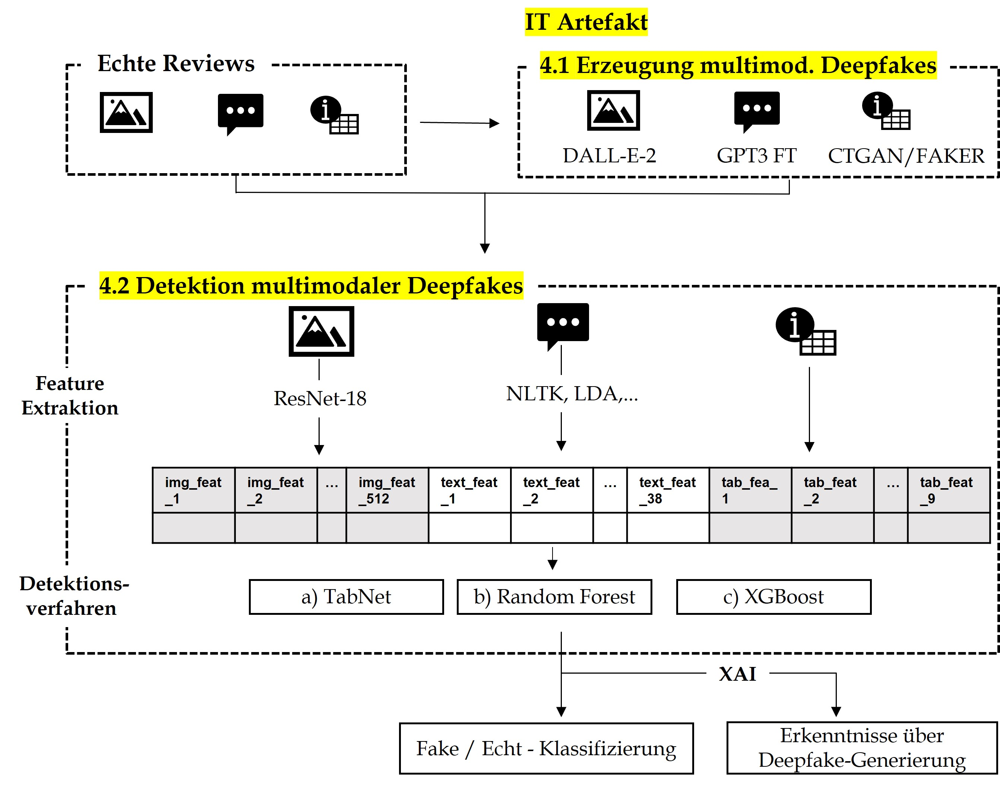

# Erzeugung und Erkennung multimodaler Deepfakes bei Online Rezensionen

Dieses Projekt beschäftigt sich mit der Erkennung von gefälschten Bewertungen (Fake-Reviews) auf Online-Plattformen. Hierbei wird ein multi-modaler Ansatz verfolgt, der auf verschiedenen Modalitäten wie Text, Bild und Metadaten basiert.

## Wichtige Notebooks:

1. `nb_generate_dataset.ipynb`: In diesem Notebook werden relevante Informationen aus den Daten extrahiert, verarbeiten, Daten herausgefiltert. Als Resultat wird der  Basissätze `real_base_sent_reduced.csv` generiert (s. unten).

2. `nb_generate_deepfakes.ipynb`: Auf Basis der Kategorie aus Notebook 1 werden hier auf allen Modalitäten Fake-Reviews generiert. Hier werden der echte Datensatz `base_....csv` und der gefälschte Datensatz `fake_base_gpt_3_...` zusammengeführt zu `merged_fake_real.csv`. Dieser Datensatz dient als neue Ausgangsbasis für die Detektion.

3. `nb_feature_extraction.ipynb`: Hier werden die Features für alle Modalitäten extrahiert und im Datensatz `features_enrichted[..].csv` gespeichert. Dieser Datensatz wird für die Detektion herangezogen.

4. `nb_fake_detection.ipnyb`: Zuerst wird der Datensatz in Trainings-, Validierungs- und Testdatensatz aufgeteilt (`detection_train.csv`, `detection_val.csv` und `detection_test.csv`). Anschließend werden XGBoost, Random Forest und TabNet trainiert und die Hyperparameter anhand des Validierungsdatensatzes optimiert. Abschließend wird das Modell evaluiert.

5. `nb_generated_gpt3_finetune_datasets.ipynb`: In diesem Notebook werden verschiedene GPT3 Finetunes vorbereitet und dafür benötigte Datensätze erzeugt.

6. `nb_frontend_optional_showcase_v0.ipynb`: Eventuell wird hier für die Präsentation anhand einer prototypischen Frontend das Artefakt vorgestellt. Dieses Notebook ist noch nicht fertiggestellt.

## Wichtige Datensätze  

1.  `real_base_sent_reduced.csv`: enthält Informationen von 704 multimodalen echten Google Maps Reviews, zufällig ausgewählt aus über ca. 9000 multimodalen Reviews von  `l.01_Data\raw_data\dataset_weitere_forschung_relCols.csv` Der Datensatz wurde schon auf wesentliche Spalten reduziert und wird im Notebook `nb_generate_dataset.ipynb` generiert.

2. `fake_gpt3_all_finetunes_sent__dalle_tab.csv`: bildet die Fake-Reviews ab, alle Modalitäten mit unterschiedlichen Technologien erzeugt und als Spalte angehängt (GPT3 Finetune, DALL-E-2, CTGAN und Faker genutzt). Wird in  Notebook  `nb_generate_deepfakes.ipynb`. Darüber lässt sich auch auf die künstliche genierten Bilder zugreifen. Hier sind auch die Ergebnisse der verschiendeenen Finetune-Varianten enthalten. 

3.  `base_for_feature_extraction.csv`: bildet den zusammengesetzten Datensatz aus 704 multimodalen Fakes und 704 Echten Reviews ab, mit URL zu den echten und gefakten Bildern, als Grundlage für Feature Extraction und letztendlich auch Detektion. Darüber lässt sich auch auf die künstliche genierten Bilder zugreifen. Der Text wird hier anhand der Fintune-Variante v4 verwendet. 

4. `features_enriched_tab_img_text.csv`: ist mit den extrahierten Features aller Modalitäten angereichert, wird im Notebook `nb_feature_extraction.ipynb` erstellt. Nach einigen kleineren preprocessing Schritten nochmals in Form von `features_enriched_tab_img_text_preproc.csv` abgespeichert. 

5. Datensätze für den Data Split:
- `detection_train.csv`
- `detection_test.csv`
- `detection_val.csv`

Es ist wichtig, dass alle Modelle und alle Modalitäten immer auf den gleichen Daten trainiert, getuned und evaluiert werden. Deshalb werden Datensätze mit 80:20 Split Train_Val : Test und nochmals 80:20 Split Train:Val erzeugt. Zu Beginn von Notebook `nb_fake_detection.ipnyb` werden diese abgespeichert.

1. Die separate Auswertung des alternativen "abgeschlossenen Bildklassifikator-Ansatzes" ist unter  `results_image_classifier.csv` aus dem Notbook `nb_generated_gpt3_finetune_datasets.ipynb` abgespeichert. 

## Weitere Informationen zur Handhabung

- Die künstlich generierten Bilder von DALL-E-2 können über den die Datensätze `base_for_feature_extraction.csv` sowie `fake_gpt3_all_finetunes_sent__dalle_tab.csv` zugegriffen werden. Um das zu ermöglichen sind die Bilder im Ordner [02_Images/](02_Images/) gehostet. 
- Die rohe Daten mit den unverarbeiteten Google Maps Reviews finden sich im Ordner [01_Data/raw_data](01_Data/raw_data/). Je nach Kategorie (Hotel, Restaurant, Aktivität) findet sich auch eine Auflistung alle potenziell verfügbaren Spalten, z.B. [Hier] (01_Data\raw_data\cols_activities.txt) alle Spalten für gescrapte Aktivitäten. 
- Es wurden mehrere Varianten von GPT3 Finetunes entwickelt und auf den Datensatz angewendet. Die hierfür benötigte Datensätze (inkl. inklusive Prompt und Prompt-Completions) sind unter [01_Data/finetuning/](01_Data/finetuning/) abgespeichert.
- Nicht direkt verwendete Dateien, veraltete Dateien und verworfenen Ansätze bzw. Versuche sind im Ordner [09_outdated_archived_or_rejected_approaches] (09_outdated_archived_or_rejected_approaches) abgelegt. Auf diese Dateien kann ggf.  zukünftige Untersuchungen zurückgegriffen werden. Darunter fallen auch Ansätze mit anderen Technologien (Stable Diffusion, GPT2, GPT3.5 Turbo, AutoTrain), die letztendlich nicht verwendet wurden. Außerdem ist dort ein [Datensatz multimodaler Amazon-Reviews](09_outdated_archived_or_rejected_approaches\amazon\dataset_amazon_reviews_v1.csv) abgelegt, der nicht verwendet wurde. 

## Ergebnisse: 

Die Ergebnisse der vergleichenden UNtersuchung in Abhängigkeit der Modalitäten und der drei verwendeten ML-Methoden XGBoost, Random Forest und TabNet sind in der folgenden Tabelle aufgelistet. 

| Modalität(en)      | Model    | Accuracy | Precision | Recall | F1     | AUC    |
|--------------------|----------|----------|-----------|--------|--------|--------|
| Unabhängig         | Coinflip | 0.4964   | 0.4966    | 0.5177 | 0.5069 | 0.4964 |
| Text               | TabNet   | 0.5248   | 0.5235    | 0.5532 | 0.5379 | 0.5248 |
| Text               | RF       | 0.5142   | 0.5147    | 0.4965 | 0.5054 | 0.5142 |
| Text               | XGB      | 0.5567   | 0.5548    | 0.5745 | 0.5645 | 0.5567 |
| Img                | TabNet   | 0.8901   | 0.8929    | 0.8865 | 0.8897 | 0.8901 |
| Img                | RF       | 0.8901   | 0.8986    | 0.8794 | 0.8889 | 0.8901 |
| Img                | XGB      | 0.8865   | 0.8811    | 0.8936 | 0.8873 | 0.8865 |
| Tab                | TabNet   | 0.6702   | 0.7727    | 0.4823 | 0.5939 | 0.6702 |
| Tab                | RF       | 0.7305   | 0.7778    | 0.6454 | 0.7054 | 0.7305 |
| Tab                | XGB      | 0.7199   | 0.7385    | 0.6809 | 0.7085 | 0.7199 |
| Tab+Text           | TabNet   | 0.6064   | 0.6339    | 0.5035 | 0.5613 | 0.6064 |
| Tab+Text           | RF       | 0.7199   | 0.7627    | 0.6383 | 0.6950 | 0.7199 |
| Tab+Text           | XGB      | 0.7163   | 0.7163    | 0.7163 | 0.7163 | 0.7163 |
| Tab+Img            | TabNet   | 0.9184   | 0.9214    | 0.9149 | 0.9181 | 0.9184 |
| Tab+Img            | RF       | 0.8936   | 0.9051    | 0.8794 | 0.8921 | 0.8936 |
| Tab+Img            | XGB      | 0.9291   | 0.9172    | 0.9433 | 0.9301 | 0.9291 |
| Text+Img | TabNet | 0.9078 | 0.9323 | 0.8794 | 0.9051 | 0.9078 |
| Text+Img | RF | 0.8830 | 0.8913 | 0.8723 | 0.8817 | 0.8830 |
| Text+Img | XGB | 0.8972 | 0.8944 | 0.9007 | 0.8975 | 0.8972 |
| Tab+Text+Img | TabNet | 0.9326 | 0.9178 | 0.9504 | 0.9338 | 0.9326 |
| Tab+Text+Img | RF | 0.8901 | 0.8986 | 0.8794 | 0.8889 | 0.8901 |
| Tab+Text+Img | XGB | 0.9149 | 0.9149 | 0.9149 | 0.9149 | 0.9149 |

## Verständnis mit SHAP-Analyse

Die Vorhersagen wurden 